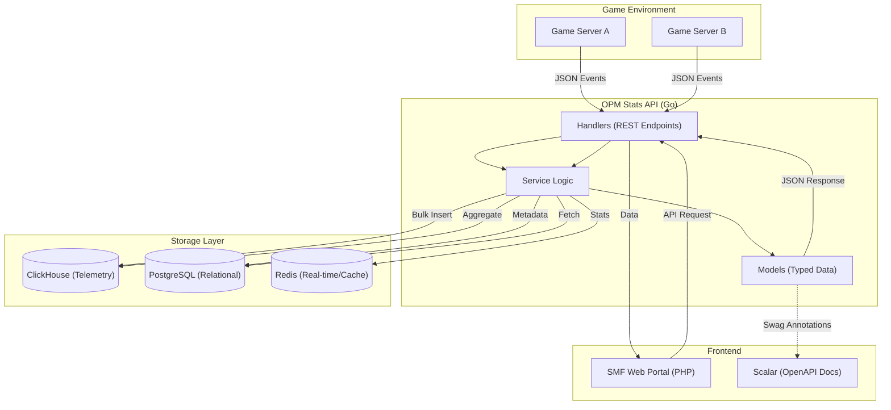
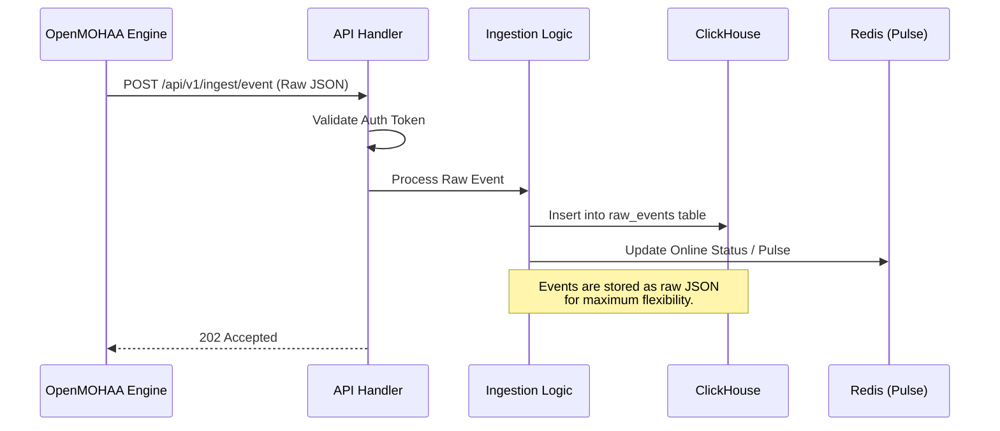
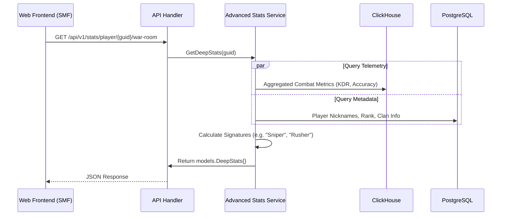

# OPM Stats API: Visual Guide

This guide provides a visual overview of how the OPM Stats API functions, from data ingestion to statistics retrieval and automated documentation.

## 1. High-Level Architecture

The OPM Stats API acts as the central hub for the entire ecosystem, connecting real-time game events with persistent storage and the web frontend.

---

## 2. Data Ingestion Flow (Sequenced)

When a player is killed or an objective is captured, the game engine sends a burst of data.

---

## 3. Statistics Retrieval & Aggregation

Requests for complex stats (like the War Room or Leaderboards) involve cross-database aggregation.

---

## 4. Documentation & Schema System

We use a "Code-First" approach to documentation ensures the spec is always in sync with the types.

1.  **Definitions**: Structs are defined in `internal/models`.
2.  **Annotations**: Handlers in `internal/handlers` are decorated with `// @Summary`, `// @Success`, etc.
3.  **Generation**: Running `./generate_docs.sh` invokes `swag init`.
4.  **Presentation**: The generated `web/static/swagger.yaml` is consumed by **Scalar** for an interactive UI.

---

## 5. Key Components Reference

| Component | Responsibility |
| :--- | :--- |
| **Handlers** | Route matching, request validation, JSON encoding/decoding. |
| **Logic** | Business rules, complex SQL/ClickHouse queries, achievement calculations. |
| **Models** | Source of truth for API contracts. Shared between logic and handlers. |
| **Interfaces** | Decouples components for easier testing and modularity. |
